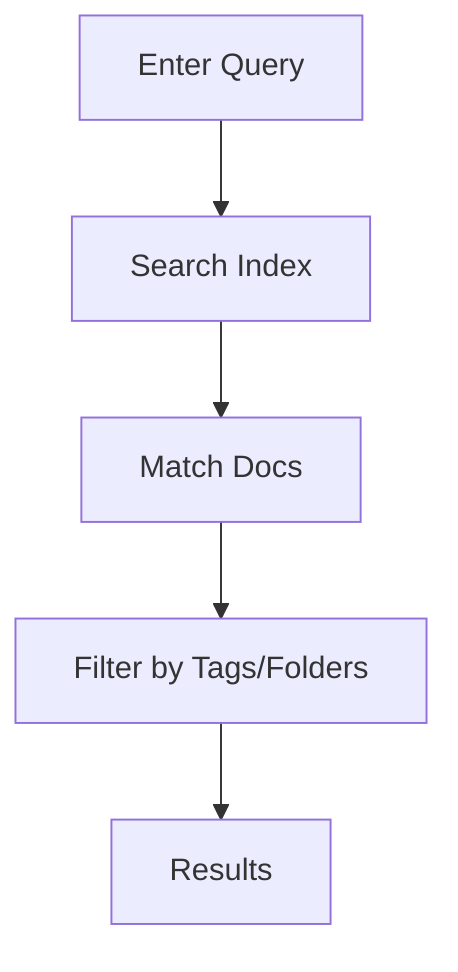

## Overview

Val empowers you to create, manage, and collaborate on documentation efficiently. You get powerful tools for editing, version tracking, searching, and sharing—all in one space. Start by exploring the core features below to see how Val fits your workflow.

<Columns cols={2}>
  <Card title="Document Creation & Editing" icon="edit-3" href="#document-creation">
    Build rich documents with markdown, embeds, and real-time previews.
  </Card>
  <Card title="Version Control" icon="git-branch" href="#version-control">
    Track changes, revert commits, and maintain history effortlessly.
  </Card>
  <Card title="Search & Organization" icon="search" href="#search-organization">
    Find content instantly and structure your docs with folders and tags.
  </Card>
  <Card title="Collaboration & Sharing" icon="users" href="#collaboration-sharing">
    Invite teams, review changes, and publish with secure links.
  </Card>
</Columns>

## Document Creation and Editing

Jump into document creation with Val's intuitive editor. You support markdown, code blocks, and embeds from tools like GitHub or Figma. Real-time previews ensure your content looks perfect before publishing.

<Steps>
  <Step title="Create New Document" icon="plus">
    Click the "New Doc" button in your dashboard.
  </Step>
  <Step title="Edit with Markdown" icon="edit">
    Use familiar syntax for headings, lists, and tables.
  </Step>
  <Step title="Preview & Publish" icon="eye">
    Toggle live preview and hit publish.
  </Step>
</Steps>

<CodeGroup tabs="Markdown,API">
  ````markdown
# Welcome to Val

## Quick Start

- Install via npm
- Configure your space
- Start editing
  ````

  ```javascript
  const val = new ValClient({ apiKey: 'YOUR_API_KEY' });
  const doc = await val.docs.create({
    title: 'New Document',
    content: '# Hello Val\n\nYour content here.'
  });
  ```
</CodeGroup>

<Callout kind="tip">
  Use `<!-- val:embed https://github.com/repo -->` for seamless embeds.
</Callout>

## Version Control and History Tracking

Val automatically saves every change as a versioned commit. You view diffs, restore previous versions, or branch for experiments—all without leaving your editor.

<Tabs>
  <Tab title="View History" icon="clock">
    Open the history panel to see a timeline of edits.
  </Tab>
  <Tab title="Revert Changes" icon="undo">
    Select a version and click "Restore" to roll back.
  </Tab>
  <Tab title="Compare Diffs" icon="git-compare">
    Side-by-side view highlights additions and deletions.
  </Tab>
</Tabs>

## Search and Organization

Locate any document instantly with Val's full-text search. Organize using nested folders, tags, and custom metadata for scalable projects.



| Feature | Description |
|---------|-------------|
| Full-Text Search | Searches titles, content, and metadata |
| Tags | Add labels like `api`, `guide` for filtering |
| Folders | Nested structure for teams and projects |

<Expandable title="Advanced Search Tips" default-open="false">
  Combine queries: `auth AND javascript` yields precise results. Use `tag:internal` for private docs.
</Expandable>

## Collaboration and Sharing

Invite team members with role-based permissions. You co-edit in real-time, leave comments, and share public or password-protected links.

<Request tabs="Invite,Share" show-lines="false">
  ```javascript
  await val.users.invite({
    email: 'team@company.com',
    role: 'editor'
  });
  ```

  ```javascript
  const link = await val.docs.share(docId, {
    public: true,
    password: 'optional-pass'
  });
  ```
</Request>

<Callout kind="success">
  Real-time cursors show who's editing where.
</Callout>

Ready to build? Check the [quickstart](/quickstart) for hands-on setup.