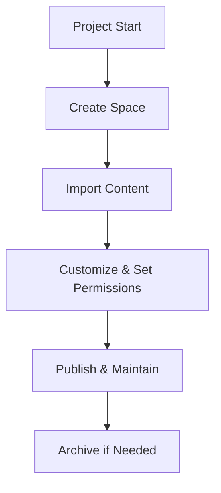

## Overview

Val allows you to create dedicated documentation spaces for your projects. Each space acts as a self-contained environment where you organize pages, manage permissions, and customize layouts. Use spaces to separate public docs from internal wikis or client-specific guides.

<Columns cols={3}>
  <Card title="Create Spaces" icon="plus" href="#creating-spaces">
    Set up new spaces in seconds.
  </Card>
  <Card title="Import Content" icon="upload" href="#importing-documentation">
    Bring in existing Markdown or Git repos.
  </Card>
  <Card title="Customize" icon="settings" href="#customizing">
    Tailor layouts and access controls.
  </Card>
</Columns>

## Creating and Deleting Spaces

### Creating a New Space

Follow these steps to create a space from the Val dashboard.

<Steps>
  <Step title="Navigate to Spaces" icon="layout">
    Click the `{spaces}` icon in the sidebar.
  </Step>
  <Step title="Add New Space">
    Select `New Space` and enter a name like `Project Alpha Docs`.
  </Step>
  <Step title="Configure Basics">
    Choose visibility (`Public` or `Private`) and add a description.
  </Step>
  <Step title="Save and Publish">
    Click `Create`. Your space is ready at `https://docs.val.com/spaces/project-alpha`.
  </Step>
</Steps>

### Deleting a Space

<Callout kind="danger">
  Deleting a space removes all pages permanently. Export content first if needed.
</Callout>

Use these steps to delete safely:

<Steps>
  <Step title="Open Space Settings">
    Go to your space and click `Settings` > `Danger Zone`.
  </Step>
  <Step title="Confirm Deletion">
    Type the space name to verify, then select `Delete Space`.
  </Step>
</Steps>

## Importing Existing Documentation

Import content from various sources to populate your space quickly.

<Tabs>
  <Tab title="GitHub" icon="github">
    Connect your GitHub repo for automatic syncs.

    <Steps>
      <Step title="Authorize Val">
        In space settings, select `Import from GitHub` and grant access.
      </Step>
      <Step title="Select Repo">
        Choose `your-org/docs-repo` and map branches to pages.
      </Step>
    </Steps>

    Example API call for programmatic import:

    <CodeGroup tabs="cURL,JavaScript">
      ```bash
      curl -X POST https://api.example.com/v1/spaces/import \
        -H "Authorization: Bearer YOUR_API_KEY" \
        -d '{
          "source": "github",
          "repo": "your-org/docs-repo",
          "branch": "main"
        }'
      ```
      ```javascript
      const response = await fetch('https://api.example.com/v1/spaces/import', {
        method: 'POST',
        headers: {
          'Authorization': 'Bearer YOUR_API_KEY',
          'Content-Type': 'application/json'
        },
        body: JSON.stringify({
          source: 'github',
          repo: 'your-org/docs-repo',
          branch: 'main'
        })
      });
      ```
    </CodeGroup>
  </Tab>
  <Tab title="Local Files" icon="upload">
    Drag and drop Markdown files or ZIP archives.

    <ol>
      <li>Select `Import Local` in settings.</li>
      <li>Upload files structured as `/pages/index.mdx`.</li>
      <li>Val processes and publishes automatically.</li>
    </ol>
  </Tab>
</Tabs>

<ParamField path="source" param-type="string" required="true">
  Import source: `{github}`, `{gitlab}`, `{local}`.
</ParamField>

<ParamField header="Authorization" param-type="string" required="true">
  Bearer token for Git providers.
</ParamField>

## Customizing Layouts and Permissions

Tailor your space appearance and control access.

### Layout Customization

Use the visual editor to adjust themes, navigation, and sidebars. Apply Val's brand color `{#3B82F6}` for headers.

| Option          | Description                          | Default |
|-----------------|--------------------------------------|---------|
| Theme           | Light, Dark, or Custom CSS           | Light  |
| Navigation      | Sidebar, Topbar, or Breadcrumbs      | Sidebar|
| Footer          | Custom links and branding            | None   |

### Permissions

Manage who can view, edit, or admin your space.

<ExpandableGroup>
  <Expandable title="Role-Based Access" default-open="true">
    Assign roles via space settings:

    - `Viewer`: Read-only access.
    - `Editor`: Create and update pages.
    - `Admin`: Full control, including deletions.

    Invite users by email or team.
  </Expandable>
  <Expandable title="Advanced Permissions">
    Use API for granular controls:

    ```javascript
    await fetch('https://api.example.com/v1/spaces/{spaceId}/permissions', {
      method: 'POST',
      headers: { 'Authorization': 'Bearer YOUR_API_KEY' },
      body: JSON.stringify({
        userId: 'user-123',
        role: 'editor'
      })
    });
    ```
  </Expandable>
</ExpandableGroup>

## Best Practices for Organization

Organize spaces effectively to scale your documentation.

<Callout kind="tip">
  Limit spaces to one project or audience. Use pages and folders within spaces for structure.
</Callout>

- Name spaces descriptively: `API-v2-Docs` instead of `Docs`.
- Version spaces: `MyApp-v1.0`, `MyApp-v2.0`.
- Set permissions early to avoid rework.
- Regularly archive inactive spaces.



Follow these practices to keep your Val documentation efficient and user-friendly.